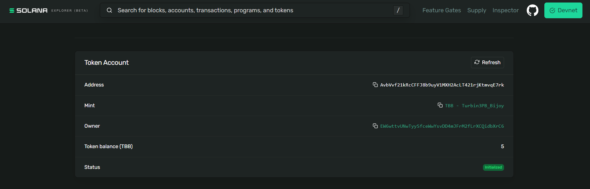

# Vault

A simple vault contract that allows user to lock their token untill desired goal is reached.

## Functionality

- **InitializeVault**: Allows user to initalize a vault and set a token saving goal (How much token the user wants to save before withdraw).
- **DepositToken**: User can deposit registered token and increase the amount in vault
- **WithdrawToken**: Once the set goal is reached user can withdraw the tokens from the vault

## Tokens locked in vault



[Click Here](https://explorer.solana.com/address/AvbVvf21kRcCFFJ8b9uyV1MXH2AcLT421rjKtmvqE7rk?cluster=devnet) to visit in solana explorer

- **Token**: BzezyWUhhQK2K84uypVnXHSojxcDMt2ZyymfwcWj1TVR

- **Vault Initialization Sigature**: n2gbpC3SBMY6aZF8iohRRHBd4akn7tn6oSwUTuUqtvpc3vhRdgGPpv1Hdj8WP5wC9SGZjAzM12L1qVXjZxp6pZP
- **Vault Token Deposit Signature**: 4tuYa57meZhuw8LBEmWV18WDZS1LZLkfk8A67ExmSz151gpRThGK4Zp6EGKdb1GprdTFHwaGGKWAJXeYWNNQUMCn

## Installation & Build

```bash
npm install

anchor build
```

## Tests
```
anchor test
```

## Deployment

Inside Anchor.toml replace `[programs.localnet]` to `[programs.devnet]` and replace `cluster = "localnet"` under `[provider]` to `cluster = "devnet"`

```bash
solana config set --url devnet
anchor deploy
```